# Application walkthrough (screenshots)

Screenshots of the running sample, taken with `dotnet run --project src/SteamItems.AppHost` (Aspire + Podman). Images are in [screenshots/](screenshots/), palette-compressed PNGs.

Flow: pick Steam items in **Web**, export to Excel, upload it to **S3 (LocalStack)**, the S3 event lands on **SQS**, the **Worker** processes it row by row into `worker.db`, and **Web** shows the job status.

## 1. Web app (Fila dark theme)

| | |
|---|---|
| **Home** (anonymous) | **Login** (Identity, OIDC) |
| 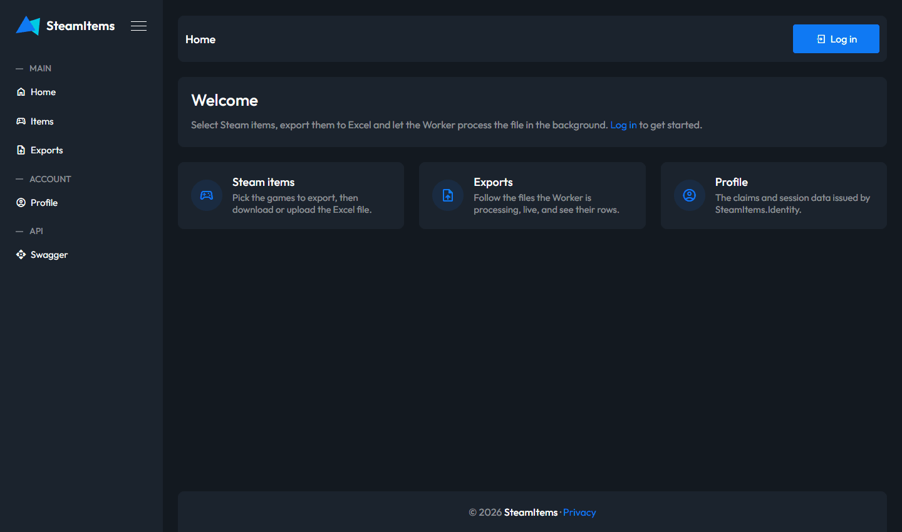 | 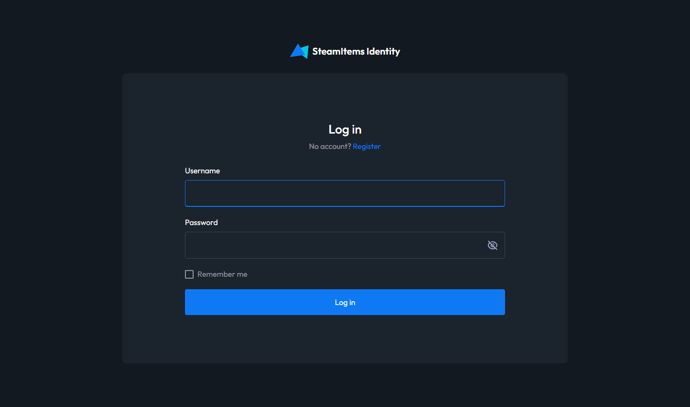 |

Test users: `alice` / `bob`, password `Pass123$`.

### Steam items

Select items and click **Save selection**. From there: **Download Excel** or **Upload Excel**.

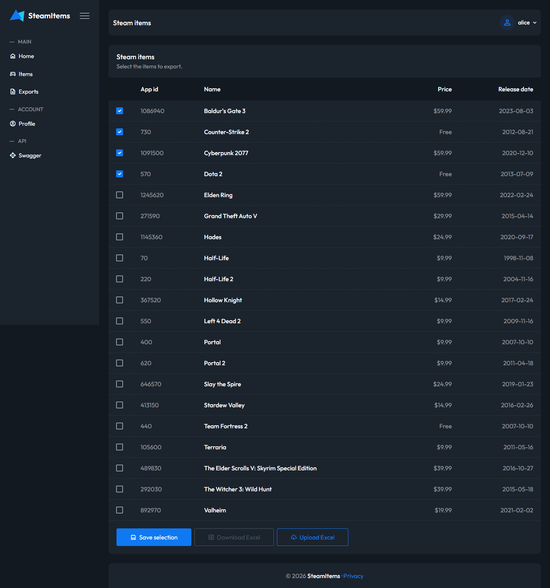

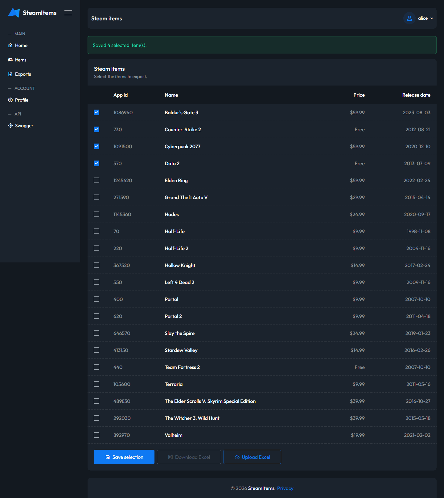

### Exports and job status

After **Upload Excel** the export is `Pending`; the Worker picks it up and the row turns `Completed` live over SignalR.

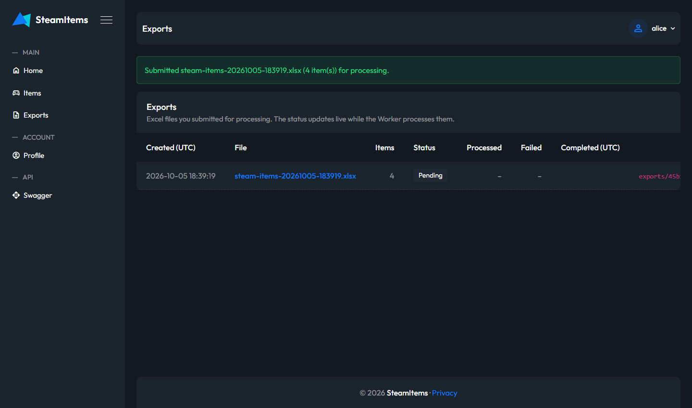

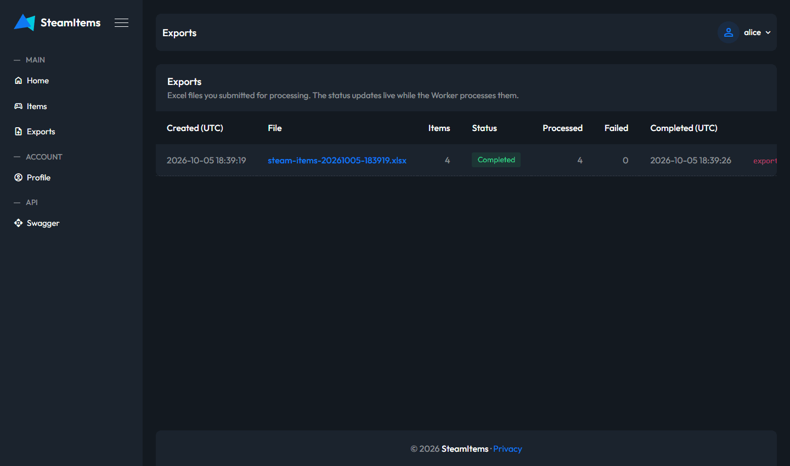

The detail page lists every processed row, with its status and error (if any):

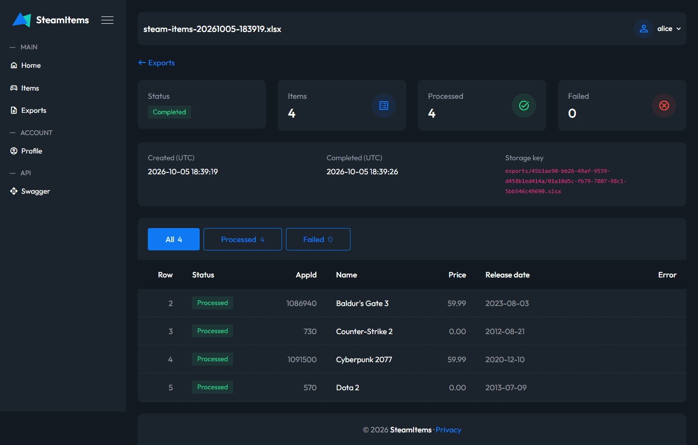

### Profile and Swagger

| Profile (requires login) | Swagger UI (`/swagger`, API login via Identity) |
|---|---|
| 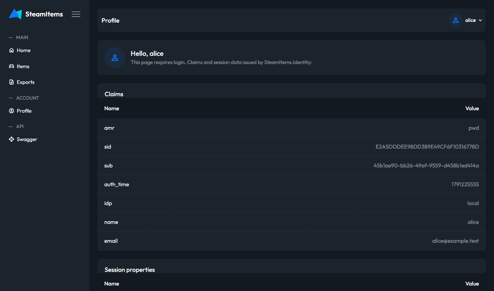 | 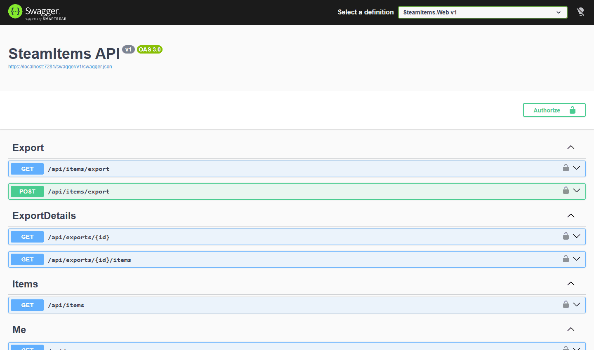 |

## 2. Local stack

Everything except the .NET services runs in containers, started by the AppHost (or `docker compose up -d`, see [README](../README.md)).

### Aspire dashboard

Resources started by the AppHost: LocalStack, s3manager, sqlite-web, Identity, Web and Worker.

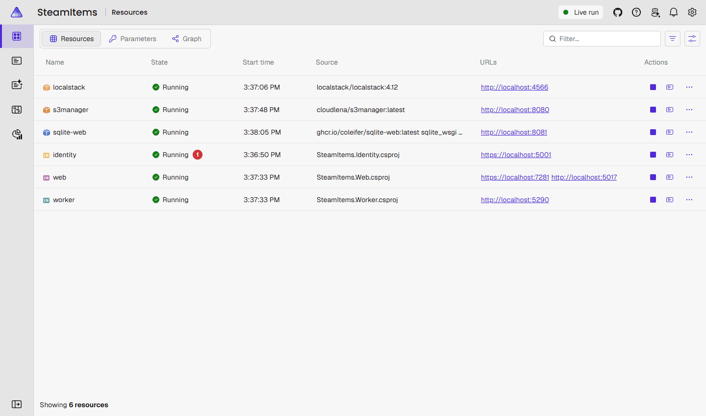

| Service | URL |
|---|---|
| Web | https://localhost:7281 |
| Identity | https://localhost:5001 |
| Worker (status API) | http://localhost:5290 |
| LocalStack (S3 + SQS) | http://localhost:4566 |
| s3manager | http://localhost:8080 |
| sqlite-web | http://localhost:8081 |

> The screenshots of s3manager were taken on the port Podman published for the container, because `8080` was already taken on the machine. Under a free `8080` the URL above works as listed.

### S3 browser (s3manager)

Bucket `steam-items-uploads`, created by the LocalStack init script:

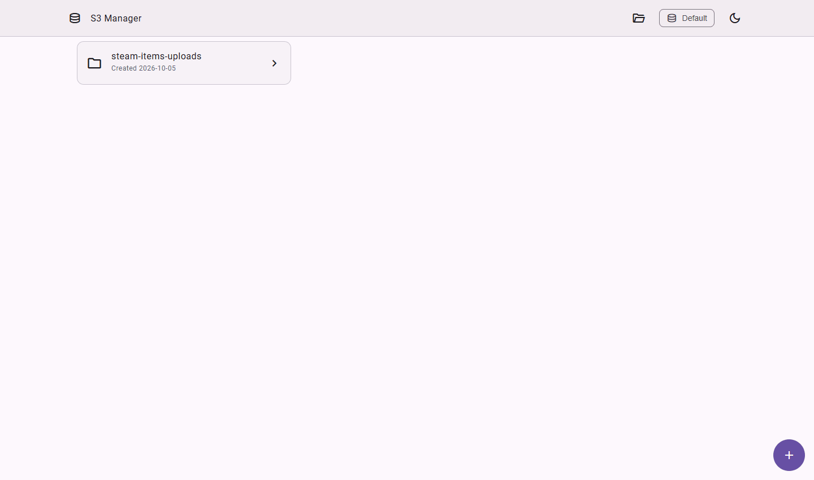

The uploaded workbook, stored under `exports/{userId}/{exportId}.xlsx`:

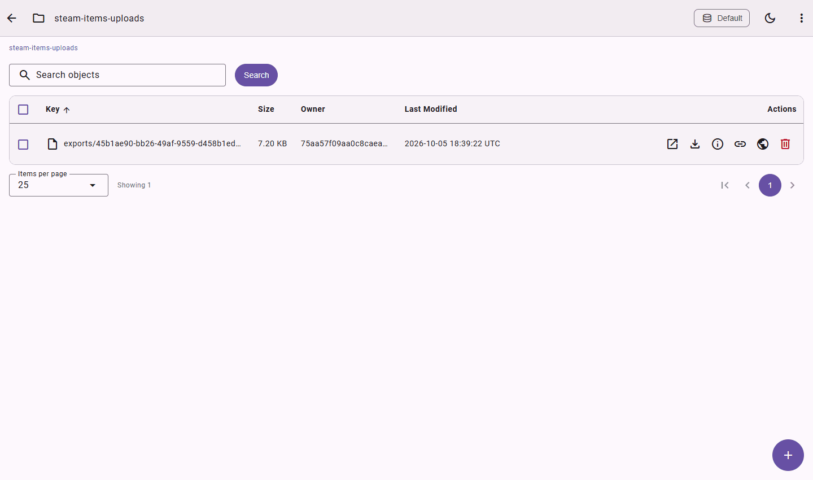

## 3. Database web UI (sqlite-web)

Read-only browser for `data/worker/worker.db` and `data/web/web.db`. Switch database from the header dropdown.

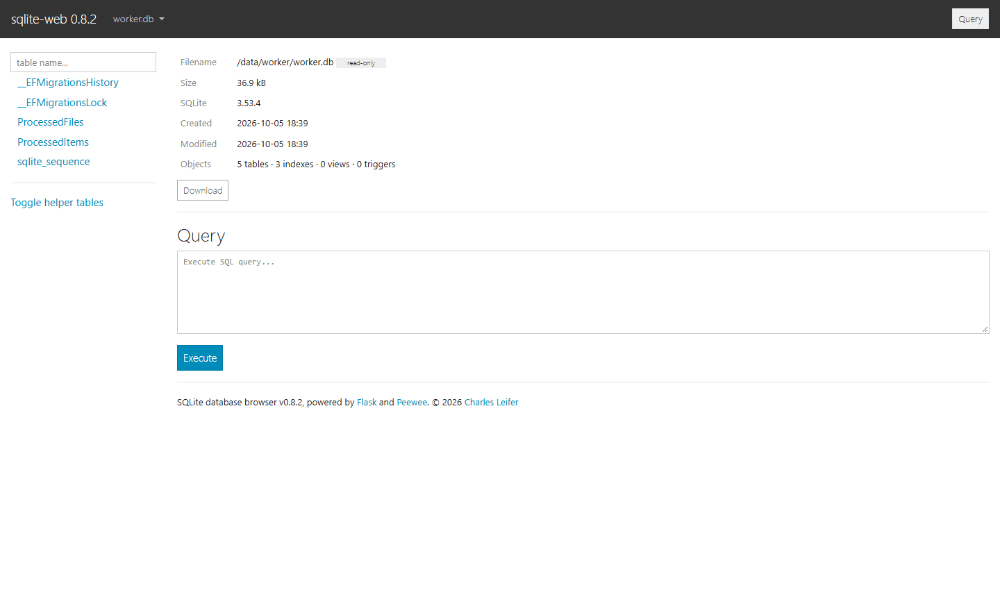

**worker.db**: `ProcessedFiles` (one row per uploaded file) and `ProcessedItems` (one row per Excel row):

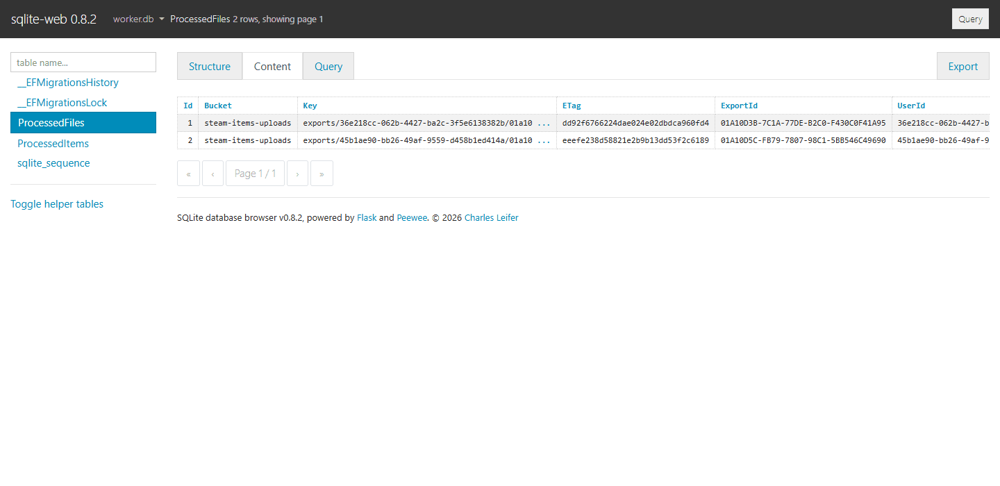

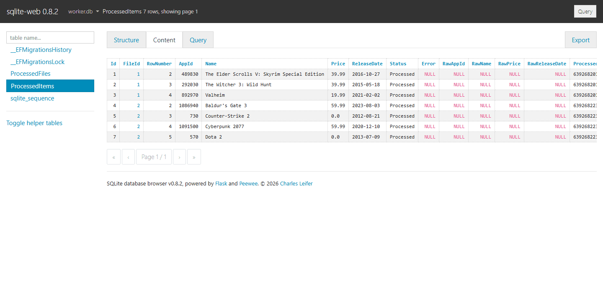

**web.db**: `Exports` (the job status that Web polls from the Worker), plus `SteamItems` and `UserSelections`:

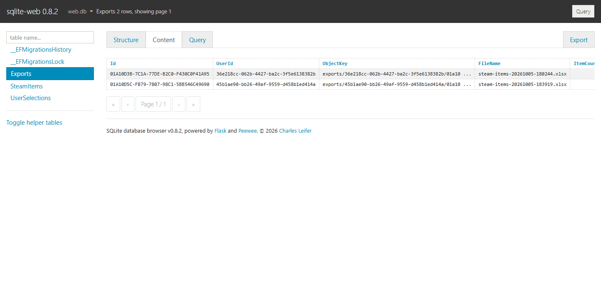
